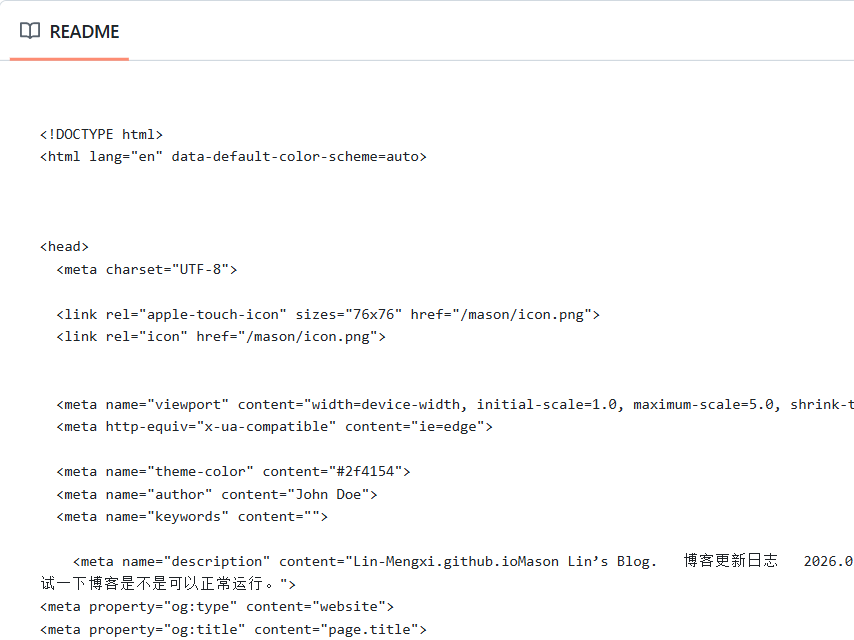
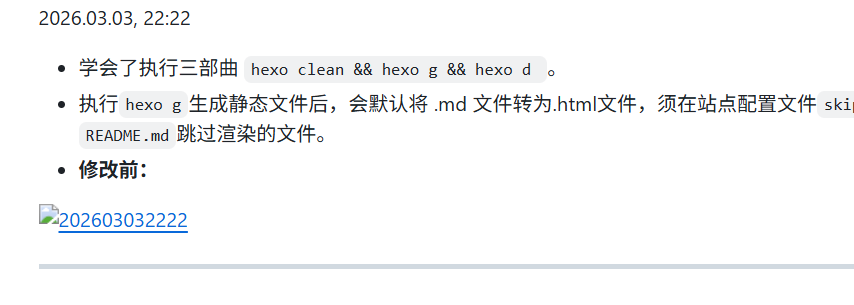

# Lin-Mengxi.github.io
Mason Lin's Blog.

---

> 博客更新日志

---

2026.03.03, 22:12

- 更新了个寂寞，试一下博客是不是可以正常运行。

---

2026.03.03, 22:22

- 学会了执行三部曲 `hexo clean && hexo g && hexo d `。
- 执行`hexo g`生成静态文件后，会默认将 .md 文件转为.html文件，须在站点配置文件`skip_render:`后添加`README.md`跳过渲染的文件。
- **修改前：**

---

2026.03.03, 22:42

- 修复了`README.md`文件中图片不显示的问题。

- 正确路径`mason_readme/PixPin_2026-03-03_22-43-59.png`

- **修改前：**

---

2026.03.04, 09:01

- 添加`GPL-3.0 license`。

---

